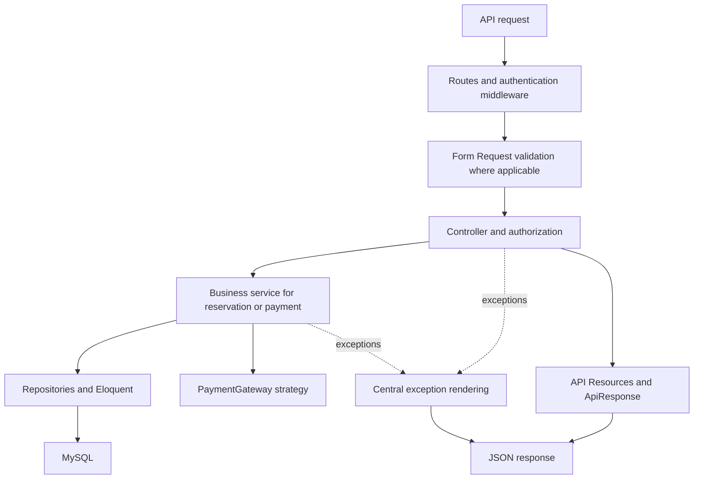

# Architecture and Design Decisions

This document explains how the Ticket Reservation API is built, why its main design choices were made, and where to find the implementation and tests. For installation and payment setup, see the [README](../README.md).

## 1. Spec-driven development with Spec Kit

The project followed a spec-driven workflow: define requirements, clarify ambiguous business rules, choose a technical design, break it into tasks, implement, and verify observable behavior.

`constitution → specification and clarification → plan and research → tasks → implementation → verification`

The following artifacts make that workflow traceable:

| Artifact | Role |
| --- | --- |
| [constitution.md](../.specify/memory/constitution.md) | Project principles, scope boundaries, integrity requirements, and quality expectations. |
| [spec.md](../specs/001-ticket-reservation/spec.md) | User stories, functional requirements, acceptance criteria, and recorded clarifications. |
| [checklists/requirements.md](../specs/001-ticket-reservation/checklists/requirements.md) | Specification quality checklist used before implementation planning. |
| [plan.md](../specs/001-ticket-reservation/plan.md) | Initial architecture, technology choices, implementation structure, and constitution checks. |
| [research.md](../specs/001-ticket-reservation/research.md) | Technical decisions and their rationale, including MySQL concurrency and payment integration. |
| [data-model.md](../specs/001-ticket-reservation/data-model.md) | Entities, relationships, persistence rules, and constraints. |
| [contracts/api.md](../specs/001-ticket-reservation/contracts/api.md) | Planned endpoints, access rules, requests, and response examples. |
| [contracts/payment-gateway.md](../specs/001-ticket-reservation/contracts/payment-gateway.md) | Planned provider-independent payment boundary and amount conventions. |
| [tasks.md](../specs/001-ticket-reservation/tasks.md) | Implementation and testing work organized into 13 phases with requirement/story traceability. |
| [quickstart.md](../specs/001-ticket-reservation/quickstart.md) | Initial setup and manual verification walkthrough. |

Clarification mattered because payment failure, expiry, retry, and late success affect seat ownership. Those decisions were recorded before implementation: failure preserves the original hold, retries never extend it, and late success requires an atomic availability check for every original seat.

### Implementation evolved after the initial plan

The initial plan deliberately omitted repositories and a custom gateway factory. Later requested refactoring introduced those components, API Resources, centralized application exceptions, and a shared response envelope.

The linked Spec Kit files document that original planning baseline; some architecture descriptions and response examples have not been updated to reflect these later changes. This document describes the current implementation. Current response shapes are defined by [ApiResponse](../app/Http/Responses/ApiResponse.php), the [Resources](../app/Http/Resources), and the endpoint tests. Do not copy older response paths from the planning contract without checking them against the current API.

## 2. Request flow and separation of responsibilities



Read-only endpoints can call repositories directly; not every request needs a business service.

| Layer | Responsibility and files |
| --- | --- |
| Routing and bootstrap | [routes/api.php](../routes/api.php) defines the 12 endpoints; [bootstrap/app.php](../bootstrap/app.php) enables API routing and exception rendering. |
| Controllers | [AuthController](../app/Http/Controllers/Api/AuthController.php), [EventController](../app/Http/Controllers/Api/EventController.php), [ReservationController](../app/Http/Controllers/Api/ReservationController.php), and [PaymentController](../app/Http/Controllers/Api/PaymentController.php) coordinate HTTP input, operations, and responses. |
| Validation | [RegisterRequest](../app/Http/Requests/RegisterRequest.php), [LoginRequest](../app/Http/Requests/LoginRequest.php), and [CreateReservationRequest](../app/Http/Requests/CreateReservationRequest.php) validate account input and distinct seat labels belonging to one event. |
| Authorization | [ReservationPolicy](../app/Policies/ReservationPolicy.php) restricts viewing and payment initiation to the owner. |
| Business operations | [ReservationService](../app/Services/ReservationService.php) owns atomic reservation creation; [PaymentService](../app/Services/PaymentService.php) coordinates checkout and notification processing. |
| Persistence | [UserRepository](../app/Repositories/UserRepository.php), [EventRepository](../app/Repositories/EventRepository.php), [SeatRepository](../app/Repositories/SeatRepository.php), [ReservationRepository](../app/Repositories/ReservationRepository.php), and [PaymentRepository](../app/Repositories/PaymentRepository.php) encapsulate application queries, creation, and row-lock retrieval. |
| Presentation | [UserResource](../app/Http/Resources/UserResource.php), [EventResource](../app/Http/Resources/EventResource.php), [SeatResource](../app/Http/Resources/SeatResource.php), and [ReservationResource](../app/Http/Resources/ReservationResource.php) select public fields; [ApiResponse](../app/Http/Responses/ApiResponse.php) wraps them consistently. |

Services retain transaction boundaries and state-transition decisions. Repositories participate in those transactions; extracting queries does not move locking outside the transaction. PaymentService still updates loaded Eloquent models when applying a payment outcome.

## 3. Data model and reservation lifecycle

The main models are [User](../app/Models/User.php), [Event](../app/Models/Event.php), [Seat](../app/Models/Seat.php), [Reservation](../app/Models/Reservation.php), and [Payment](../app/Models/Payment.php). The [reservation-seat pivot migration](../database/migrations/2026_09_18_000006_create_reservation_seat_table.php) associates a reservation with its selected seats. A reservation can have multiple payment attempts.

A new reservation stores a server-calculated total, selected seats, `status=pending`, and a fixed `expires_at` 30 minutes in the future.

| Situation | Result |
| --- | --- |
| Pending and current time is before expiry | Seats are held. |
| Payment fails | Payment attempt becomes failed; the reservation keeps its original hold. |
| Owner retries before expiry | A new attempt is created without changing seats, total, or expiry. |
| Current time reaches expiry | An incomplete reservation is presented as expired and stops blocking seats. |
| Matching verified success while the hold is active | Reservation becomes completed and seats become sold. |
| Matching verified success after expiry | Complete only if every original seat is still available; otherwise record payment success without completing the reservation. |

`expired` is derived by the Reservation model, not written as a database status. Availability queries use completed reservations and pending reservations with `expires_at > now()`, so expiry does not depend on a scheduler.

Selected seats remain attached for reference even after expiry. Their presence in a reservation response does not mean they are still held. ReservationResource exposes reservation status and `last_payment` separately because successful payment and successful seat allocation are different outcomes.

## 4. Handling race conditions

**Problem:** two requests can both read a seat as available before either writes its reservation.

**Implementation:** ReservationService starts a database transaction. SeatRepository selects the requested seat rows in ascending ID order with `lockForUpdate()`. Only after acquiring those locks does the service check for completed reservations or active holds. If any seat is unavailable, it throws an exception and the transaction creates no partial reservation. Otherwise it creates the reservation and attaches all seats before committing.

For example, requests for `[A1, A2]` and `[A2, A3]` compete for A2. The losing request must not retain A1 or A3 as a partial hold. Consistent seat-lock ordering reduces deadlock risk; it is not a claim that all possible database deadlocks are impossible.

Late successful payments use the same seat-lock boundary when checking whether expired seats can be acquired. A concurrent new booking cannot legitimately allocate the same seats through that path.

**Evidence:** [ConcurrentReservationTest](../tests/Feature/Concurrency/ConcurrentReservationTest.php) starts separate PHP processes through [worker.php](../tests/Feature/Concurrency/worker.php). It exercises same-seat competition, overlapping selections, and late payment competing with rebooking. These tests use actual MySQL locking, configured in [phpunit-concurrency.xml](../phpunit-concurrency.xml). They check specific race scenarios rather than proving every possible production interleaving.

## 5. Idempotent payment notifications

**Problem:** a provider can deliver the same notification more than once, including concurrently. Reprocessing it must not repeat allocation or overwrite an already settled outcome.

PaymentService applies a verified notification inside a transaction:

1. PaymentRepository retrieves the payment by reference with `lockForUpdate()`.
2. Unknown references are rejected. If the payment is no longer pending, processing returns without changing state.
3. The reservation is locked, the payment outcome is recorded, and completion rules are evaluated.
4. The transaction commits those changes together.

The [payments migration](../database/migrations/2026_09_18_000007_create_payments_table.php) also makes payment references and non-null provider transaction IDs unique. If a transaction ID has already been recorded, the service handles that unique-constraint conflict as a duplicate; unrelated unique-constraint failures are rethrown.

A duplicate late success cannot retry seat allocation later just because seats have become available. A delayed failure cannot undo an already processed success for the same attempt. Failures from another attempt also do not undo a completed reservation.

This is **notification-processing idempotency**, not an idempotency-key mechanism for every POST request. Calling the payment initiation endpoint again during an active hold creates a new payment attempt. The current policy treats the first verified outcome of an attempt as terminal.

**Evidence:** [PaymentWebhookTest](../tests/Feature/PaymentWebhookTest.php) covers duplicate delivery and notification outcomes; the concurrency test also sends duplicate notifications from separate processes.

## 6. Strategy, Factory, and dependency injection

### Strategy: interchangeable provider behavior

[PaymentGateway](../app/Contracts/PaymentGateway.php) defines two operations: initiate hosted checkout and verify/normalize a notification. [FakePaymentGateway](../app/Payments/FakePaymentGateway.php) and [PaymobGateway](../app/Payments/PaymobGateway.php) implement that contract.

[PaymentIntent](../app/Payments/PaymentIntent.php) carries the checkout reference and hosted URL. [PaymentNotification](../app/Payments/PaymentNotification.php) carries the normalized reference, transaction ID, outcome, amount in minor units, currency, and payment time.

PaymentService depends on the contract, so provider-specific HTTP requests and signature algorithms stay inside each strategy.

### Factory: configured gateway creation

[PaymentGatewayFactory](../app/Payments/PaymentGatewayFactory.php) reads `payment.driver`, finds its class in `payment.drivers`, checks that the class implements PaymentGateway, and resolves it through Laravel's container. Unknown or invalid registrations are rejected.

[AppServiceProvider](../app/Providers/AppServiceProvider.php) binds the PaymentGateway interface to that factory. Laravel then injects the selected implementation into consumers automatically:

```text
PaymentGateway dependency
  → AppServiceProvider binding
  → PaymentGatewayFactory
  → payment.drivers mapping
  → FakePaymentGateway or PaymobGateway
```

[config/payment.php](../config/payment.php) reads `PAYMENT_DRIVER` from the environment. This is a configuration-driven factory; adding a compatible provider does not require another conditional branch inside it.

### Adding another gateway

Implement PaymentGateway, normalize its results into the two shared payment objects, register its class in `payment.drivers`, add its configuration, and select its driver through the environment. Clear cached configuration after changing it. Add adapter tests with fake HTTP responses before using it.

The current interface receives a parsed payload only. Providers needing raw request bytes or signature headers require a compatible extension to the verification boundary and controller. Also, the application selects one global driver for initiation and webhook verification: switching drivers while old payments are outstanding does not automatically route those old callbacks to their original provider. The nullable transaction ID uniqueness constraint is global, not scoped per provider.

**Evidence:** [PaymentGatewayFactoryTest](../tests/Feature/PaymentGatewayFactoryTest.php) covers configured resolution, explicit driver selection, extension registration, and invalid registrations. [PaymobGatewayTest](../tests/Unit/PaymobGatewayTest.php) exercises the adapter with Laravel HTTP fakes. Paymob setup is documented in the [README](../README.md#trying-paymob).

## 7. Security, money, and API contracts

- **Authentication and ownership:** Sanctum bearer tokens protect user actions, while ReservationPolicy enforces ownership. Logout revokes the current token only. Events are public.
- **Payment trust:** webhook verification is independent of user login. Before completion, PaymentService checks the normalized amount and currency against the reservation total and configured currency. Browser redirects do not complete reservations.
- **Exact money:** prices and totals use integer minor units, with fixed EGP/two-decimal presentation. Three seats priced at 1010 minor units total exactly 3030, presented as `"30.30"`. Client-supplied prices are ignored. Multi-currency precision is not implemented merely by changing a configuration value.
- **Loaded relations:** reservation reads load seats and ordered payments before serialization, keeping database retrieval out of Resources.
- **Central errors:** [ApiException](../app/Exceptions/ApiException.php) carries public error metadata. [SeatUnavailableException](../app/Exceptions/SeatUnavailableException.php), [PaymentNotAllowedException](../app/Exceptions/PaymentNotAllowedException.php), [PaymentGatewayUnavailableException](../app/Exceptions/PaymentGatewayUnavailableException.php), [InvalidPaymentNotificationException](../app/Exceptions/InvalidPaymentNotificationException.php), and [UnknownPaymentReferenceException](../app/Exceptions/UnknownPaymentReferenceException.php) are rendered in bootstrap. Gateway initiation errors use a non-sensitive public message.

Application-handled success responses use:

```json
{"success": true, "message": "Reservation created successfully.", "data": {"id": 1, "status": "pending"}}
```

Application-handled errors use:

```json
{"success": false, "message": "Authentication is required.", "error": {"code": "UNAUTHENTICATED"}}
```

Validation errors use `error.code=VALIDATION_ERROR` and a field-to-messages map in `error.details`. Seat conflicts include `error.details.seats`. The current renderer explicitly handles known application, authentication, authorization, validation, and not-found exceptions; it does not yet normalize every possible unexpected/framework error into that envelope.

## 8. Verification and scope

| Concern | Tests |
| --- | --- |
| Authentication and token revocation | [AuthTest](../tests/Feature/AuthTest.php) |
| Ownership and derived expiry | [OwnershipTest](../tests/Feature/OwnershipTest.php) |
| Public browsing and availability | [EventsAndSeatsTest](../tests/Feature/EventsAndSeatsTest.php) |
| Validation and atomic reservation creation | [ReservationCreationTest](../tests/Feature/ReservationCreationTest.php) |
| Owner-only lists | [ReservationListingTest](../tests/Feature/ReservationListingTest.php) |
| Integer totals and client price tampering | [MoneyTest](../tests/Feature/MoneyTest.php) |
| Initiation failure, retry, and payment eligibility | [PaymentFlowTest](../tests/Feature/PaymentFlowTest.php) |
| Signed outcomes, duplicates, and late completion | [PaymentWebhookTest](../tests/Feature/PaymentWebhookTest.php) |
| Local webhook simulation | [PaymentSimulateTest](../tests/Feature/PaymentSimulateTest.php), exercising [PaymentSimulate](../app/Console/Commands/PaymentSimulate.php) |
| Known error envelopes | [ApiErrorContractTest](../tests/Feature/ApiErrorContractTest.php) |

The normal suite uses [phpunit.xml](../phpunit.xml); the dedicated concurrency suite uses MySQL as well. Run them sequentially when they share the same test database:

```bash
composer test
php artisan test -c phpunit-concurrency.xml
```

Provider behavior is simulated in automated tests. Those tests do not establish that a real merchant account is configured correctly or that production callbacks are reachable.

The scope is a backend API with seeded events and seats. No frontend, administration, cancellation, automatic refunds, or settlement workflow is implemented. In particular, a late successful payment may remain without a completed reservation. Gateway initiation and local persistence are also separate operations: a successful remote checkout followed by a database failure is not covered by a distributed transaction or reconciliation process.

AI assisted with planning, implementation, refactoring, and documentation. The Spec Kit artifacts, implementation, and tests provide the review trail; checked task boxes alone are not a substitute for verifying behavior.

